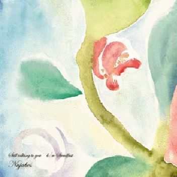
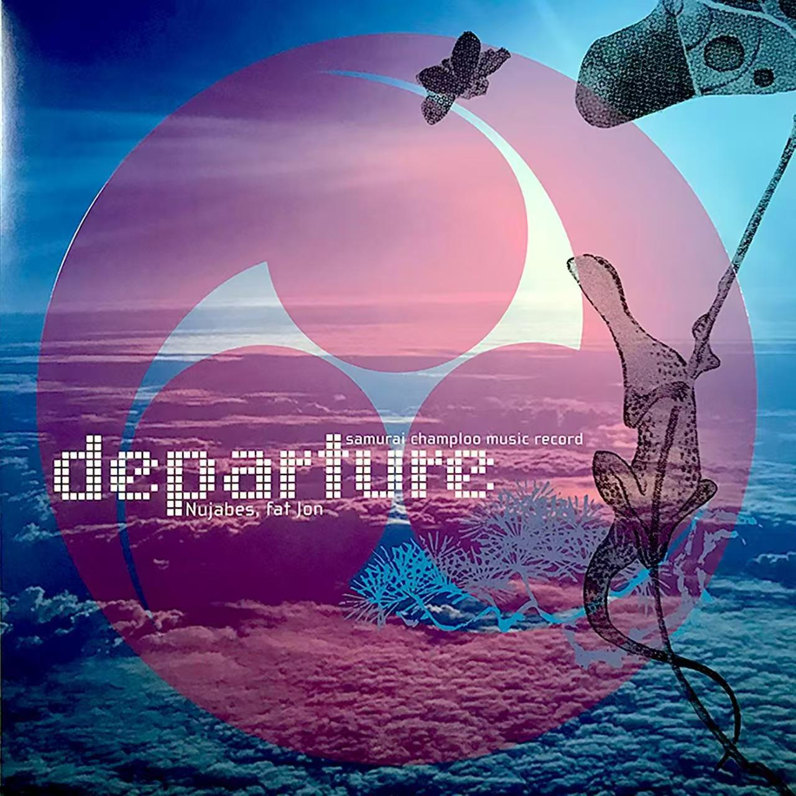
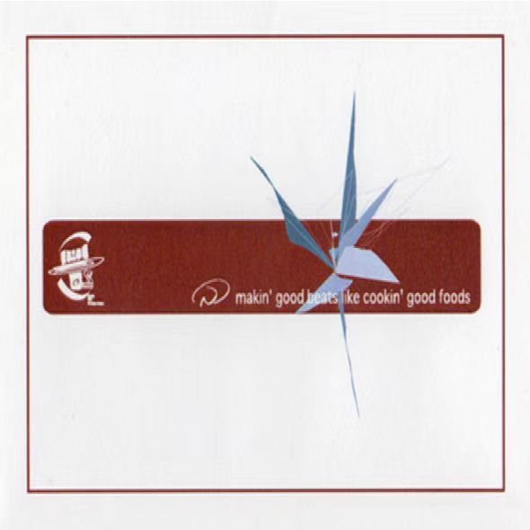

   <h1>Hi there 👋</h1>

<h3>🙎 Shi qianchuan | 🧬 Biology Student | 🏫 SUSTech </h3>

  &nbsp;&nbsp;

  

 

  <h3>About Me</h3>

  <b>I'm Shi qianchuan, currently studying Biology at the School of Medicine, Southern University of Science and Technology (SUSTech).</b>

 

  <h3>🌱 Currently learning</h3>
  

    <b>Bioinformatics, mainly working with Shell, R, and Python</b>
  

 

  <h3>🔬 Research interests</h3>
  

    <b>DNA methylation, tumor biology, and aging</b>
  

 

  <h3>Hobbies</h3>
  

    🏀 <b>I enjoy playing basketball</b> 
    🎧 <b>I love jazz and hip-hop</b>
  

 

  <h3>🎵 Currently Listening / Favorite Music</h3>
  
<b>All from Nujabes 🎹</b>

  

    
    
    
  

 

### Languages and Tools

  
  
  
  
  
  

 

  

 

<h2 align="center">🤝 Let's Connect</h2>

  <b>🔬 Always open to scientific discussions and collaborations!</b>

  <b>💡 Ideas, suggestions, or questions about bioinformatics? Feel free to reach out!</b>

  <b>📚 Learning together makes science more fun. Let's explore the mysteries of life! 🧬</b>

 

<h1 align='center'>⚡️<i>Keep coding, keep discovering! 🚀</i>⚡️</h1>

  <i>"In science, there are no shortcuts to truth."</i>

